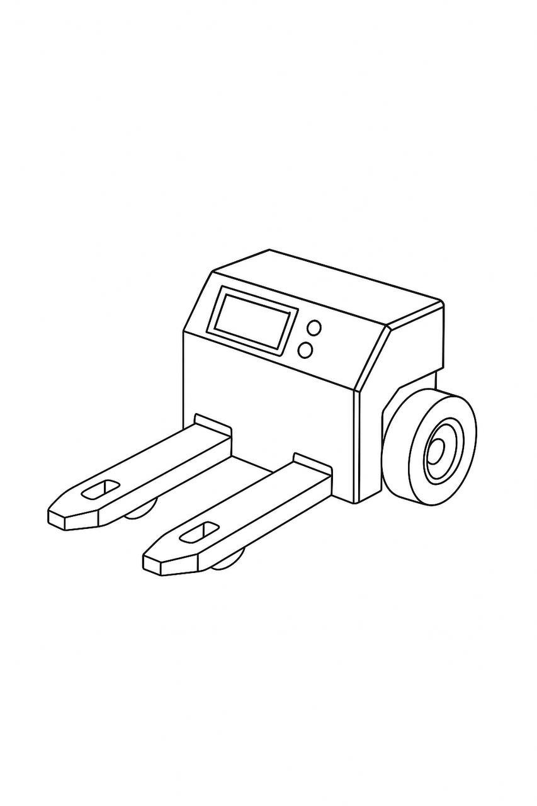
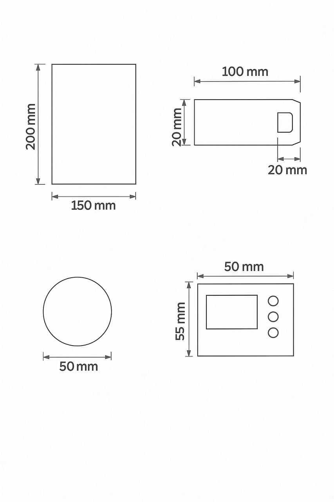

# RoboCarry_Algorithm
**RoboCarry** is a smart autonomous robot designed to automate pallet transportation in a food warehouse without any human intervention. The robot moves beneath pallets, lifts them using integrated forks, and transports them to a target location safely and efficiently.

---

##  Task Idea

The goal is to design a compact autonomous robot capable of navigating a warehouse, detecting pallets, lifting them from underneath, and delivering them to specific areas — making the warehouse fully automated.

---

##  Robot Components & Dimensions

| Component        | Dimensions (mm)     | Description                                      |
|------------------|----------------------|--------------------------------------------------|
| Base             | 150 × 200 × 100      | Main body housing the electronics and structure |
| Fork (each)      | 100 × 20 × 20        | Front fork for sliding under the pallet         |
| Wheel            | Diameter: 50         | Rubber wheels for smooth warehouse movement     |
| Control Panel    | 50 × 55              | Contains screen + 3 buttons                     |

---

## Design Sketch




---

##  Working Envelope

- **Workspace size:** 5m × 3m (example warehouse area)
- **Maximum travel path:** 4.5m
- **Max load capacity:** 25 kg
- **Speed:** up to 0.8 m/s
- **Lifting mechanism:** slides under pallet (no vertical lift)

---

## Algorithm (Execution Flow)

```plaintext
1. Start
2. Scan for pallet using proximity sensor or predefined map
3. Move toward the pallet
4. Insert forks under the pallet
5. Confirm alignment
6. Move toward destination
7. Lower forks and release pallet
8. Return to base or await next task
9. Repeat or shut down
```


